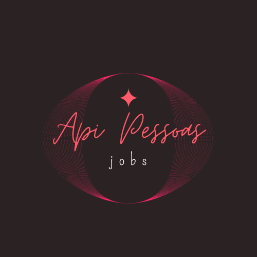

<p align="center">
  <a href="">
    
  </a>
</p>

<p align="center"><b>Projeto APIs REST em NodeJS (Desafio)</b></p>

<div align="center">


</div>

  <h1 align="center">API - Pessoas</h1>
  <h3 align="center"></h3>
  <p align="center" style="indent-text">.<p>

## Pre Requisites
<a href="https://nodejs.org/en/download/"></a></br>
<a href="https://www.mongodb.com/try/download/community"></a></br>
<a href="https://docs.npmjs.com/about-npm"></a></br>
<a href="https://code.visualstudio.com/download"></a>

# Summay

Resultados de tradução
API built in nodejs whose functionality is to manipulate data from "users" and "jobs". 


## Recursos
### Consumido
>- API
>   - POST /usuarios
>   - GET /usuarios
>   - GET /usuarios/:id
>   - PUT /usuarios/:id
>   - DELETE /usuarios/:id
>   - POST /jobs
>   - GET /jobs
>   - GET /jobs/busca?usuario=:id
>   - GET /jobs/:id
>   - PUT /jobs/:id
>   - DELETE /jobs/:id

# Compilation Guide

1. Clone the project from GitHub:

```
git clone https://github.com/Felipe-builder/api-pessoas.git
```

2. Install depencendies
```
npm install
```
3. Run

```
npm run dev
```
or

```
npm start
```

The application will respond on port `3000`, to test if it has been correctly uploaded, just access [localhost:3000](http://localhost:3000).

To end an application just press `ctrl+c` in the terminal.

## Application access

The application will respond on port `3000`, to test if it has been correctly uploaded, just access [localhost:3000](http://localhost:3000).
test users usernames and passwords 

## References

> https://nodejs.org/docs/latest-v16.x/api/index.html

> https://www.mongodb.com/docs 

> https://mongoosejs.com/docs/api.html

> https://momentjs.com/docs/
